# PANDUAN PENGGUNA - SIAPPRO
Sistem Informasi Administrasi Pelayanan Protokol (SIAPPRO) V.1

Panduan ini disusun untuk membantu pengguna (Admin & Super Admin) dalam mengoperasikan sistem SIAPPRO secara efektif dan efisien.

---

## 📑 Daftar Isi
1. [Pendahuluan](#id-1.-pendahuluan)
2. [Hak Akses Pengguna](#id-2.-hak-akses-pengguna)
3. [Cara Login & Navigasi](#id-3.-cara-login-and-navigasi)
4. [Standar Pengisian Form (PENTING)](#id-4.-standar-pengisian-form-penting)
5. [Panduan Modul](#id-5.-panduan-modul)
   - [Modul Persidangan](#b.-modul-persidangan)
   - [Modul Pelayanan Keprotokolan](#c.-modul-pelayanan-keprotokolan)
   - [Modul Kunjungan Kerja](#d.-modul-kunjungan-kerja)
   - [Modul Administrasi Perjalanan Dinas](#e.-modul-administrasi-perjalanan-dinas)
   - [Modul Penugasan Protokol (Monitoring)](#f.-modul-penugasan-protokol-monitoring)
   - [Modul Manajemen Pengguna (Khusus Super Admin)](#g.-modul-manajemen-pengguna-khusus-super-admin)
   - [Modul Log Aktivitas (Admin & Super Admin)](#h.-modul-log-aktivitas-admin-and-super-admin)
6. [Fitur Export & Laporan](#id-6.-fitur-export-and-laporan)
7. [Troubleshooting & FAQ](#id-7.-troubleshooting-and-faq)

---

## 1. Pendahuluan
SIAPPRO adalah aplikasi berbasis web yang digunakan untuk mengelola data operasional protokol. Pastikan Anda memiliki koneksi internet yang stabil dan menggunakan browser modern (Google Chrome/Microsoft Edge).

## 2. Hak Akses Pengguna
*   **Admin:** Memiliki hak untuk menginput, mengubah, dan menghapus data pada modul tertentu.
*   **Super Admin:** Memiliki hak penuh, termasuk melihat seluruh log aktivitas dan manajemen user.

## 3. Cara Login & Navigasi
1. Akses link SIAPPRO.
2. Masukkan **Username** dan **Password** Anda.
   
3. Gunakan **Sidebar (Menu Samping)** untuk berpindah antar modul.
    

4. **Dashboard / Menu Utama:**
   *   Menampilkan ringkasan agenda kegiatan hari ini.
   *   **Fitur Card:** Anda dapat mengklik **Kartu Jumlah Kegiatan** (seperti Total Kegiatan, Bandara, dll) untuk langsung menuju ke daftar data yang sudah terfilter otomatis sesuai kategori tersebut.

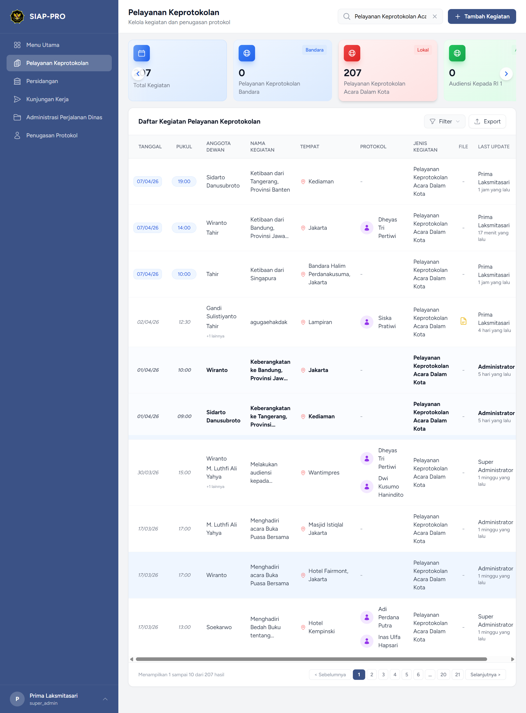

---

## 4. Standar Pengisian Form (PENTING)
> [!IMPORTANT]
> Untuk menjaga kerapihan data dan keseragaman laporan, mohon gunakan standar penulisan berikut:

| Bidang (Field) | Aturan Penulisan | Contoh Benar |
| :--- | :--- | :--- |
| **Nama Kegiatan** | Diawali Kata Kerja, Gunakan *Title Case* | Menghadiri Rapat Paripurna |
| **Lokasi** | Nama Gedung, Kota/Kabupaten | Ruang Rapat, Gedung DPRD |
| **Keterangan** | Bahasa formal, tanpa singkatan tidak baku | Mengikuti kegiatan secara daring |
| **Upload File** | Pastikan format PDF/JPG (Maks 2MB) | laporan_kegiatan.pdf |

*(Catatan: Silakan koordinasi dengan bagian humas/sekretariat untuk detail aturan lainnya)*

---

## 5. Panduan Modul

### A. Cara Umum Mengelola Data (Berlaku untuk Semua Modul)
Untuk setiap modul di bawah ini, cara mengelola datanya adalah sebagai berikut:
1.  **Tambah Data:** Klik tombol **"Tambah Data"** atau ikon **[+]**.
    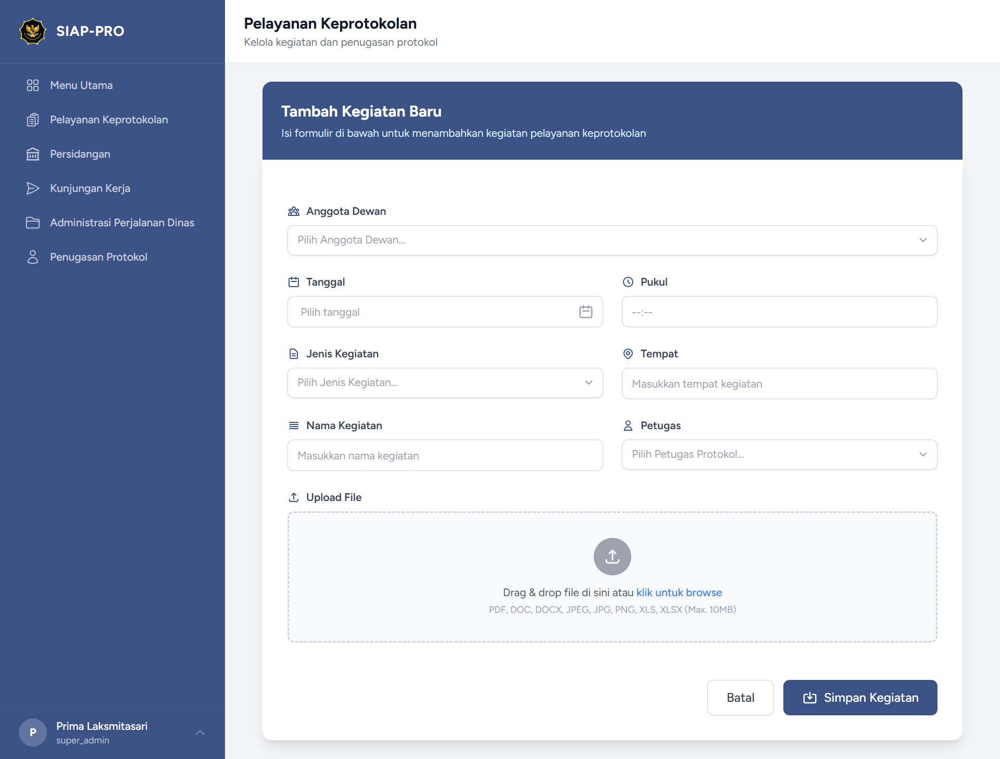
2.  **Filter/Cari:** Gunakan tombol **Filter** untuk menyaring data berdasarkan kategori atau tanggal.
    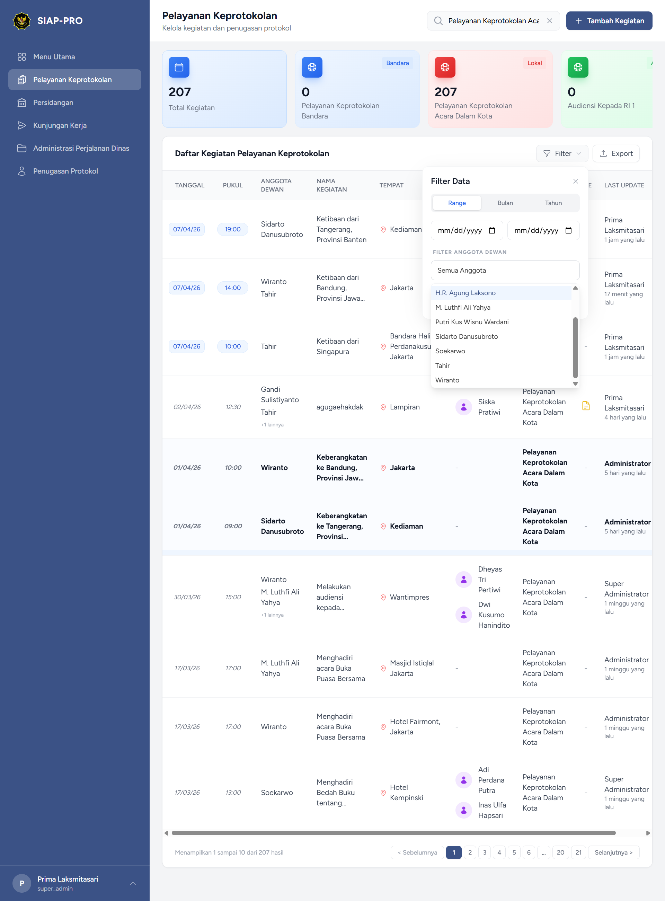
3.  **Aksi (Edit/Hapus):**
    *   Cari baris data yang ingin diubah.
    *   Klik **Ikon Titik Tiga (⋮)** di kolom paling kanan.
    *   Pilih **View (Ikon Mata Biru)** untuk melihat detail lengkap.
    *   Pilih **Edit (Ikon Pensil Biru)** untuk mengubah data.
    *   Pilih **Delete (Ikon Tempat Sampah Merah)** untuk menghapus data.

---

### B. Modul Persidangan
Modul ini digunakan untuk mencatat dan mengelola agenda persidangan.
*   **Data Utama:** Tanggal, Waktu, Nama Sidang, Ruangan, dan Keterangan.
*   **Output:** Laporan daftar sidang harian atau mingguan.

### C. Modul Pelayanan Keprotokolan
Modul ini mencatat seluruh aktivitas pelayanan protokol terhadap pimpinan atau tamu daerah.
*   **Data Utama:** Tanggal, Pukul, Anggota Dewan, Nama Kegiatan, Tempat, Protokol (Petugas), dan Jenis Kegiatan (Dalam Kota/Bandara/Dsb).
*   **Penting:** Pastikan memilih **Jenis Kegiatan** yang sesuai agar kategori laporan di dashboard akurat.

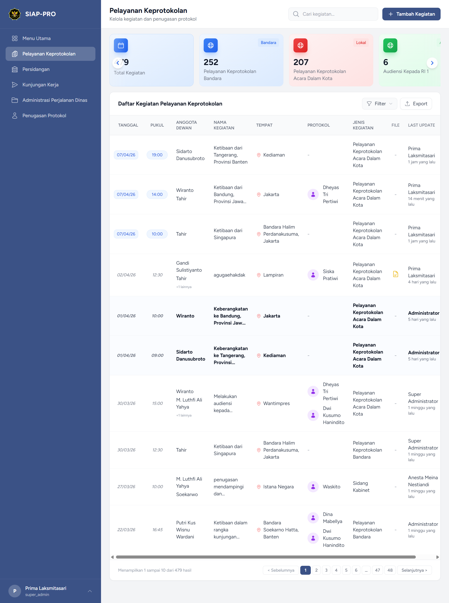

### D. Modul Kunjungan Kerja
Modul untuk mencatat agenda kunjungan kerja baik dari luar daerah (Tamu) maupun kunjungan keluar (Internal).
*   **Data Utama:** Tanggal, Instansi, Jumlah Orang, Maksud Tujuan, dan Lokasi.
*   **Dokumen:** Anda dapat mengunggah file PDF pendukung atau foto kegiatan pada kolom **File**.

### E. Modul Administrasi Perjalanan Dinas
Modul khusus untuk mengelola administrasi surat menyurat atau logistik perjalanan dinas.
*   **Data Utama:** Nama Personel, Tujuan, Tanggal Berangkat/Pulang, dan Status SPPD.
*   **Fitur:** Digunakan sebagai dasar pengecekan administrasi sebelum pencetakan dokumen dinas.

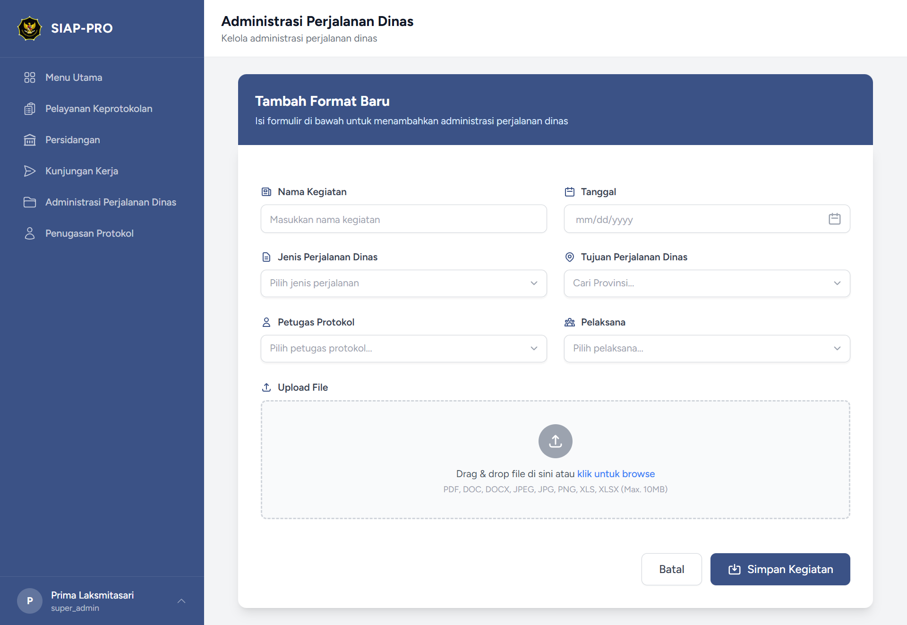

### F. Modul Penugasan Protokol (Monitoring)
Modul ini berfungsi sebagai dashboard analisis untuk memantau beban kerja seluruh tim protokol.
*   **Halaman Utama:** Menampilkan daftar nama petugas beserta profil dan total jumlah penugasan yang telah dilaksanakan.
*   **Fitur Filter & Cari:**
    *   **Filter Waktu:** Gunakan dropdown **Bulan** dan **Tahun** untuk melihat statistik pada periode tertentu.
    *   **Pencarian Nama:** Gunakan kolom **"Cari nama petugas..."** untuk menemukan personel secara spesifik.
    *   **Tombol Reset:** Klik **Reset** (ikon putar) untuk mengembalikan filter ke kondisi awal (menampilkan seluruh data).
*   **Analisis Individu:** Klik pada nama petugas untuk melihat **Rincian Per Kategori** (misal: Berapa kali bertugas di Bandara, Sidang Kabinet, atau Audiensi).
*   **Total Statistik:** Terdapat ringkasan **Total Personel** dan **Total Penugasan** kumulatif di bagian pojok kanan atas.

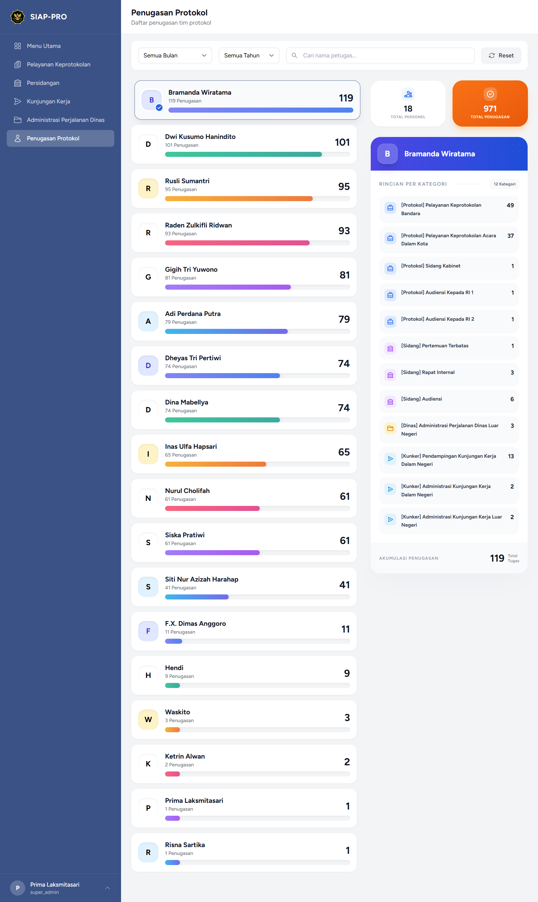

### G. Modul Manajemen Pengguna (Khusus Super Admin)
Halaman ini digunakan untuk mengelola akun siapa saja yang dapat mengakses SIAPPRO.
*   **Create User:** Klik **"+ Create User"** untuk menambah staf baru.
*   **Syarat Password:** Pengguna baru wajib memenuhi kriteria:
    *   Minimal 8 karakter.
    *   Mengandung huruf besar (Uppercase).
    *   Mengandung angka (Number).
    *   Mengandung karakter spesial (Symbol).
*   **Aksi Akun:**
    *   **Reset Password (Ikon Kunci Kuning):** Gunakan jika staf lupa password. Ikuti 3 langkah verifikasi untuk membuat password baru.
    *   **Edit User (Ikon Pensil Biru):** Mengubah peran (Role), jenis kelamin, atau menonaktifkan akun.
    *   **Delete User (Ikon Sampah Merah):** Menghapus akses pengguna secara permanen.

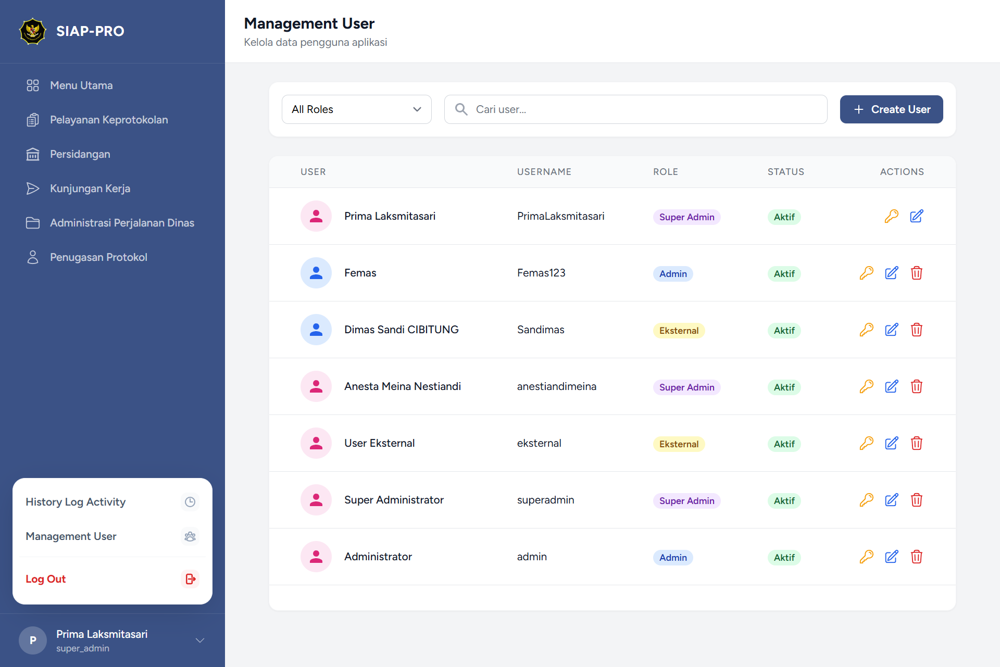

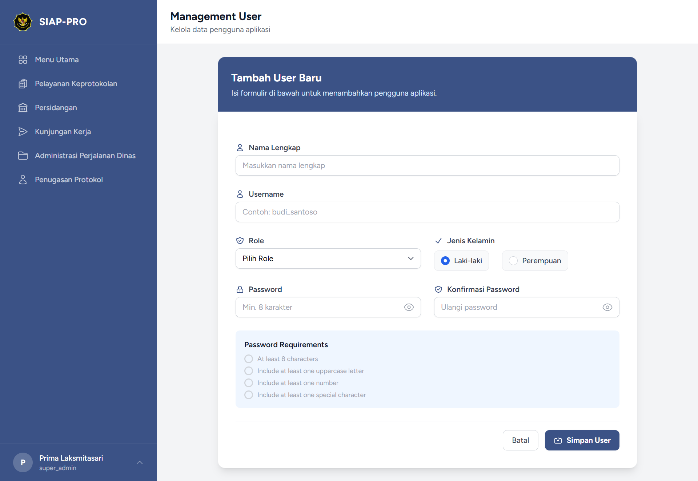

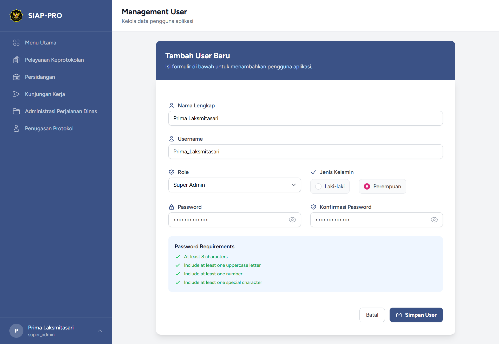

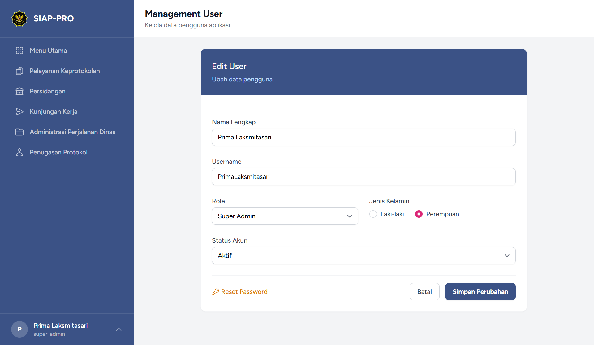

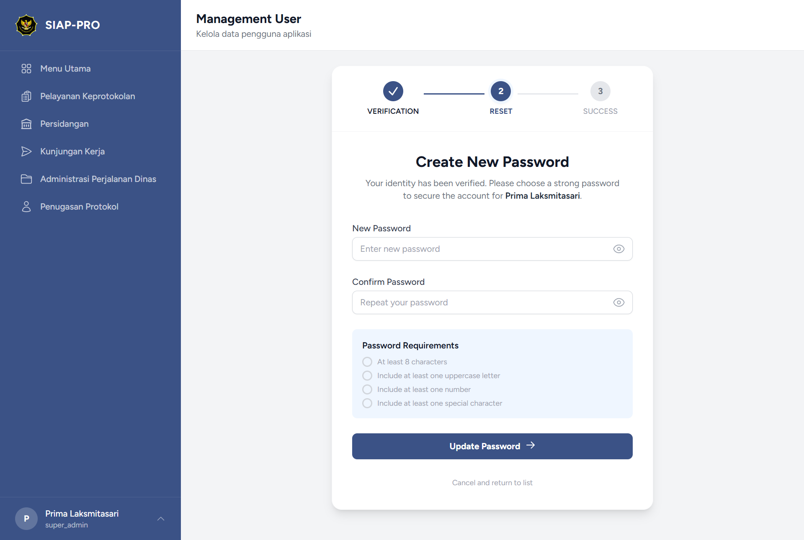

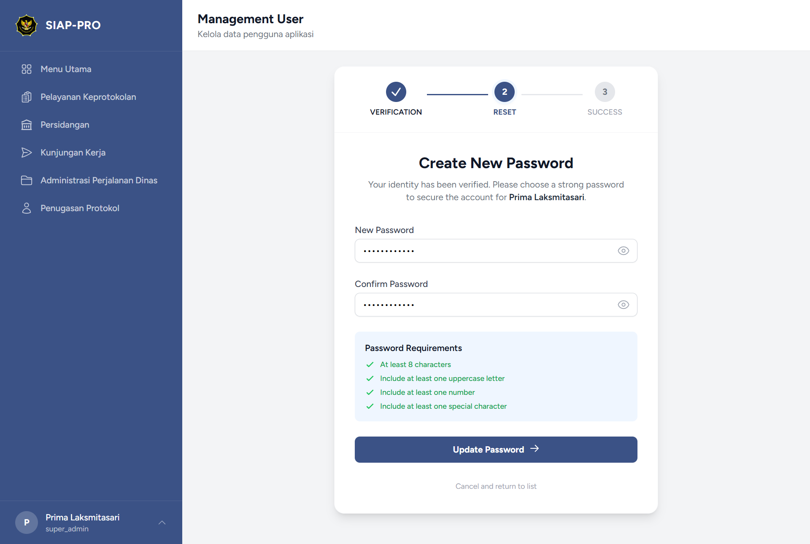
a
### H. Modul Log Aktivitas (Admin & Super Admin)
Digunakan untuk melacak setiap perubahan yang terjadi di dalam sistem (audit trail).
*   **Fungsi:** Melihat siapa yang melakukan tambah/edit/hapus data, pada jam berapa, dan modul apa yang diubah.
*   **Penting:** Fitur ini berguna untuk memastikan akuntabilitas data jika terjadi kesalahan input atau perubahan data yang mencurigakan.

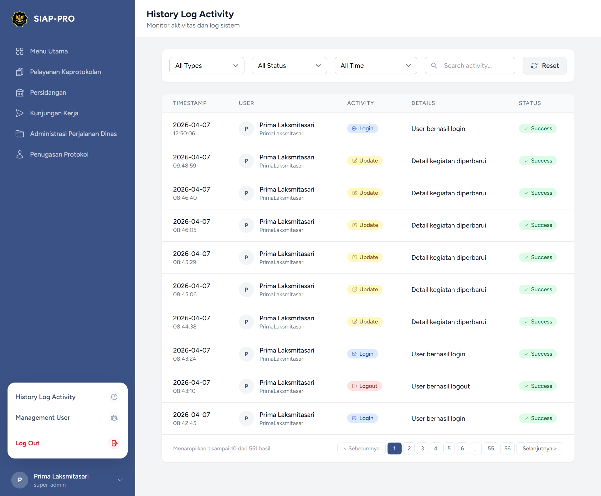

---

## 6. Fitur Export & Laporan
Fitur ini digunakan untuk mengunduh data dalam bentuk dokumen resmi. Untuk mendapatkan hasil yang akurat, ikuti urutan berikut:

### Langkah 1: Gunakan Filter (PENTING!)
Sebelum klik tombol Export, Anda **harus** menyaring data pada tabel terlebih dahulu:
*   Klik tombol **Filter** di halaman modul.
*   Pilih rentang tanggal, kategori, atau anggota dewan yang ingin dilaporkan.
*   Pastikan tabel di layar sudah menampilkan data yang Anda inginkan.

### Langkah 2: Klik Tombol Export
Setelah data pada layar sudah sesuai, klik tombol **"Export"** di pojok kanan atas.

### Langkah 3: Pengaturan Preview & Settings
Jendela **Export Preview & Settings** akan muncul. Di sini Anda bisa:
*   **Pilih Kolom Data:** Centang kolom apa saja yang ingin ditampilkan dalam laporan (misal: Tanggal, Nama Kegiatan, Tempat).
*   **Pilih Format File:** Klik pada ikon **PDF Document** (untuk laporan siap cetak) atau **Excel Sheet** (untuk olah data).

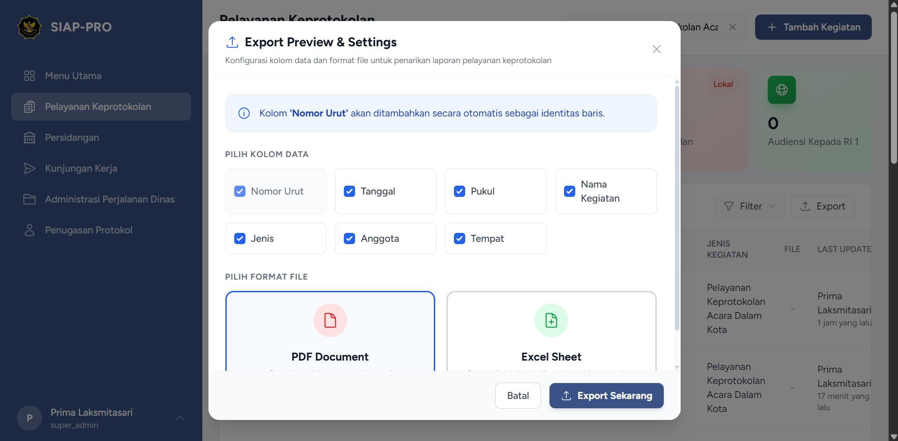

### Langkah 4: Finalisasi
Klik tombol **"Export Sekarang"**. File akan otomatis terunduh ke komputer Anda.

---

## 7. Troubleshooting & FAQ
*   **Lupa Password?** Hubungi Administrator untuk reset password.
*   **Ikon Titik Tiga Tidak Muncul?** Geser scrollbar tabel ke arah paling kanan (biasanya tertutup jika layar kecil).
*   **Halaman Error 419 (Page Expired)?** Segarkan halaman (Refresh) dan login kembali.
*   **Data Tidak Muncul?** Cek kembali filter tanggal; pastikan rentang tanggal sudah benar.

---
© 2026 SIAPPRO Team
